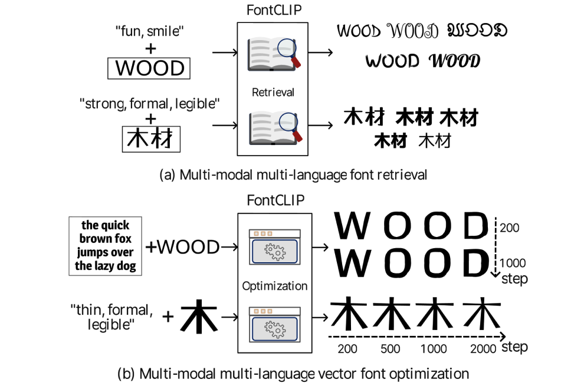
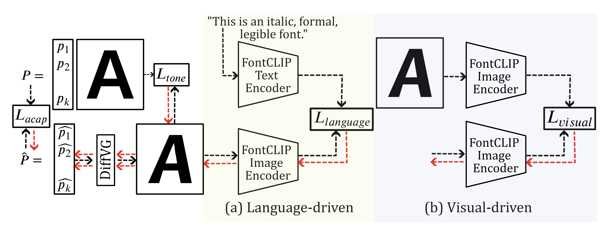

# FontCLIP: A Semantic Typography Visual-Language Model for Multilingual Font Applications

<br>
<div align="center">
    
</div>
<br><br>


## Abstract
Acquiring the desired font for various design tasks can be challenging and requires professional typographic knowledge. While
previous font retrieval or generation works have alleviated some of these difficulties, they often lack support for multiple
languages and semantic attributes beyond the training data domains. To solve this problem, we present FontCLIP – a model that
connects the semantic understanding of a large vision-language model with typographical knowledge. We integrate typographyspecific knowledge into the comprehensive vision-language knowledge of a pretrained CLIP model through a novel finetuning
approach. We propose to use a compound descriptive prompt that encapsulates adaptively sampled attributes from a font attribute
dataset focusing on Roman alphabet characters. FontCLIP’s semantic typographic latent space demonstrates two unprecedented
generalization abilities. First, FontCLIP generalizes to different languages including Chinese, Japanese, and Korean (CJK),
capturing the typographical features of fonts across different languages, even though it was only finetuned using fonts of Roman
characters. Second, FontCLIP can recognize the semantic attributes that are not presented in the training data. FontCLIP’s
dual-modality and generalization abilities enable multilingual and cross-lingual font retrieval and letter shape optimization,
reducing the burden of obtaining desired fonts.

## Approach
We propose FontCLIP, which is a [CLIP](https://github.com/openai/CLIP) model fine-tuned with [a font dataset](https://www.dgp.toronto.edu/~donovan/font/).

We have explored several fint-tuning approaches and integrated them into a Python class named `ExCLIP`.

## Applications
We propose two applications based on FontCLIP, font retrieval and vector optimization.

### Font retrieval
You can retrieve desired fonts inputting a text or image, or both of them.
Internally, the cosine distance between the input and each font in the dataset is calculated, and the fonts in top rank are returned.

You can use the demo [here](notebooks/font_retrieval.ipynb).

### Vector optimization
<br>
<div align="center">
    
</div>
<br><br>
You can deform a input character in svg format by minimizing several losses including the cosine distance in the FontCLIP latent space.

You can use the demo [here](notebooks/optimize.ipynb).


## Setup
### Create environment
1. For finetuning CLIP
```bash
conda create --name fontclip python=3.8.15
conda activate fontclip
conda install -y pytorch torchvision torchaudio pytorch-cuda=12.1 -c pytorch -c nvidia
pip install tqdm ftfy regex gdown
```


2. for vector optimization
```
conda install -y numpy scikit-image
conda install -y -c anaconda cmake=3.22.1
conda install -y -c conda-forge ffmpeg
pip install svgwrite svgpathtools cssutils numba torch-tools scikit-fmm easydict visdom freetype-py shapely ttf save_svg
pip install opencv-python==4.5.4.60  
pip install kornia==0.6.8
pip install wandb
pip install shapely

# install diffvg
git clone https://github.com/BachiLi/diffvg.git
cd diffvg
git submodule update --init --recursive
python setup.py install
```

Please be careful that the version of each library is suitable for diffvg. - see [the issue](https://github.com/BachiLi/diffvg/issues/37#issuecomment-1336335574) for details
### Download and setup a font dataset
```bash
python setup_dataset.py
```

## Finetune CLIP to produce FontCLIP
You can run the process for finetuning using the following command.
```
python train.py --random_prompt_num_per_font 10000 --sample_num 50 --color_jitter_sample_num 200 --use_lora_text
```

## ExCLIP
We have tried several finetuning methods (direct finetuning, [CoOp](https://github.com/KaiyangZhou/CoOp/), [LoRA](https://github.com/microsoft/LoRA), and [OFT](https://github.com/Zeju1997/oft)) and integrate them into one Python class named `ExCLIP`. - see [ex_clip.py](models/ex_clip.py) for details

## Licenses
### Main License
This project, based on [CLIP](https://github.com/openai/CLIP/), is licensed under MIT License - see the [LICENSE_MIT](LICENSE_MIT.md) for details

### Additional Licenses
The source codes for [CoOp](https://github.com/KaiyangZhou/CoOp/) in ExCLIP, is licensed under MIT License - see the [LICENSE_MIT](LICENSE_MIT.md) for details

The source codes for [OFT](https://github.com/Zeju1997/oft) in ExCLIP, is licensed under MIT License - see the [LICENSE_MIT](LICENSE_MIT.md) for details

The source codes for vector optimization are based on [Word-As-Image](https://github.com/Shiriluz/Word-As-Image), paritulary the files under `optimizer` folder. - see the [LICENSE.CC_BY_NC_SA_4.0](LICENSE.CC_BY_NC_SA_4.0.md) for details


## Attribution
The source codes for vector optimization are based on [Word-As-Image](https://github.com/Shiriluz/Word-As-Image) created by Shiriluz.
The original work can be found at https://github.com/Shiriluz/Word-As-Image and is licensed under CC BY-NC-SA 4.0.